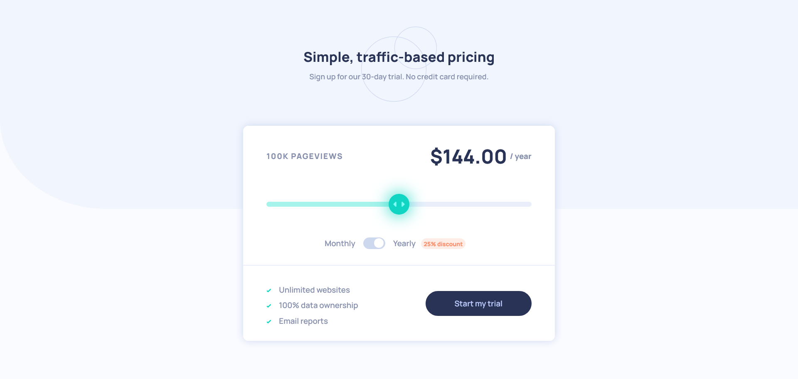

# Interactive pricing component solution

This is a solution to the [Interactive pricing component challenge on Frontend Mentor](https://www.frontendmentor.io/challenges/interactive-pricing-component-t0m8PIyY8)

## Table of contents

- [Overview](#overview)
  - [The challenge](#the-challenge)
  - [Screenshot](#screenshot)
  - [Links](#links)
- [My process](#my-process)
  - [Built with](#built-with)
  - [What I learned](#what-i-learned)
  - [Useful resources](#useful-resources)
- [Author](#author)

## Overview

### The challenge

Users should be able to:

- View the optimal layout for the app depending on their device's screen size
- See hover states for all interactive elements on the page
- Use the slider and toggle to see prices for different page view numbers (details provided below)

Here are the different page view ranges and the corresponding monthly price totals:

- 10K pageviews / $8 per month
- 50K pageviews / $12 per month
- 100K pageviews / $16 per month
- 500k pageviews / $24 per month
- 1M pageviews / $36 per month

### Screenshot

### Links

- You can take a look [here](https://darrowv.github.io/interactive-pricing-component

## My process

### Built with

- Svelte | SvelteKit
- TypeScript
- Vite
- Semantic HTML5 markup
- CSS custom properties
- Flexbox
- Media queries

### What I learned

- ***

### Useful resources

- [Svelte Tutorial](https://learn.svelte.dev/tutorial/welcome-to-svelte)
- [Input range styling](https://brennaobrien.com/blog/2014/05/style-input-type-range-in-every-browser.html)

## Author

- Github - [@darrowv](https://github.com/darrowv)
- Frontend Mentor - [@darrowv](https://www.frontendmentor.io/profile/darrowv)
- LinkedIn - [Nasyr Akhmadov](https://linkedin.com/in/darrowv)
- Telegram - [Muhammad Nasyr](https://t.me/m_nasyr)
